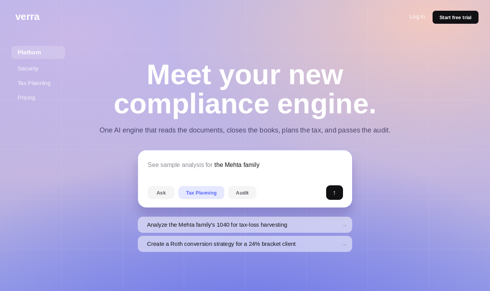
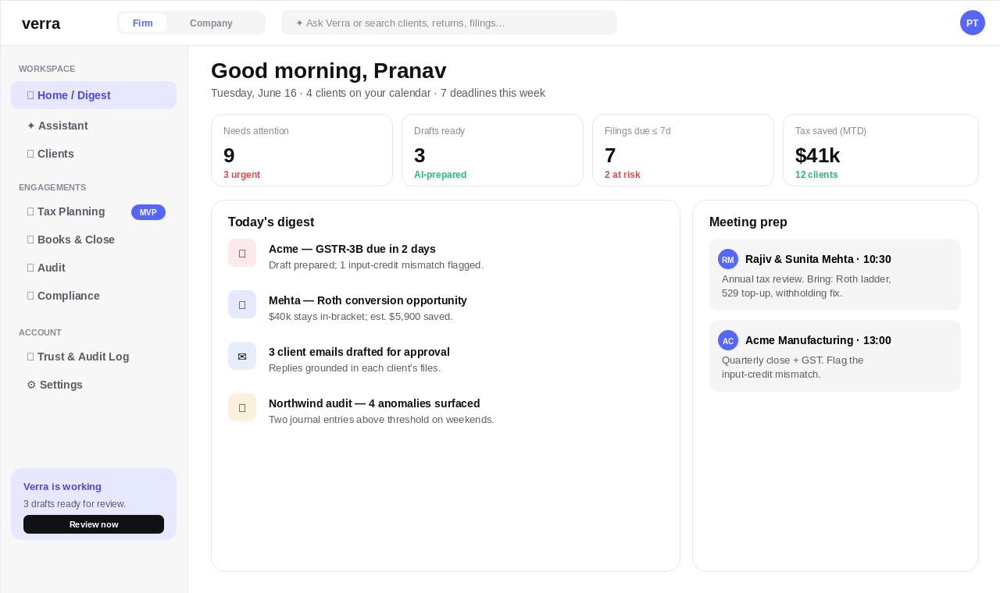
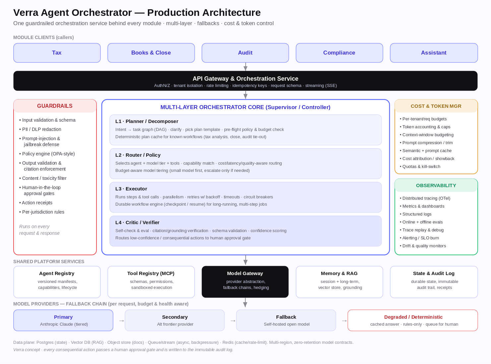
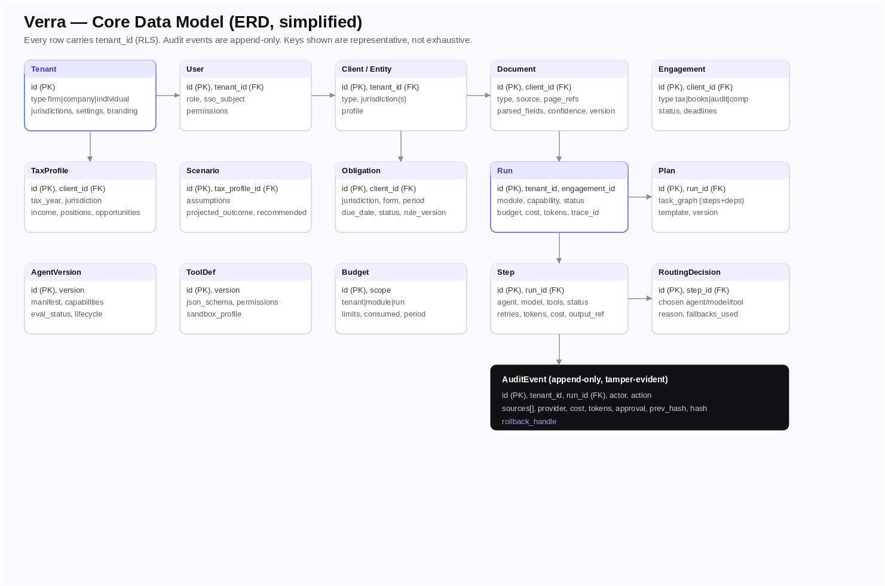
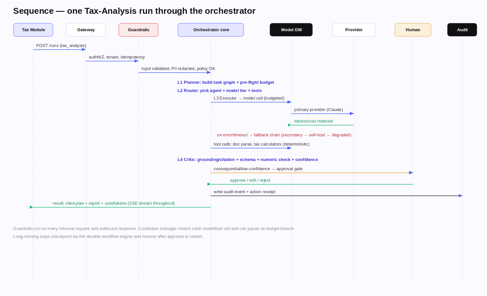
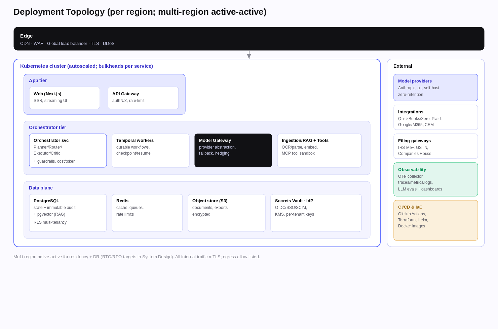

<div align="center">

# Verra

### The AI engine for accounting, tax, audit & compliance

*Reads the documents, plans the tax, closes the books, and passes the audit — with a human in control of every recommendation.*




</div>

> **What this repo is.** A from‑scratch, end‑to‑end design and build of an AI‑native B2B SaaS — product
> strategy, UX, a guardrailed multi‑agent platform, system design, and a working microservice scaffold.
> It demonstrates **product thinking**, **AI/ML systems engineering**, and **full‑stack architecture** in one place.
> *(Concept/portfolio project. UI/UX modeled on ideation. “Verra” is a working name; figures are illustrative.)*

---

## ✨ What it is

Accounting, tax, audit and compliance work is high‑volume, deadline‑driven, document‑heavy and unforgiving
of error — and the people who do it are scarce. **Verra ingests a client's financial documents once,
understands them, and turns them into prepared work across all four domains**, while a licensed professional
approves anything consequential. It is **multi‑tenant** (firms · companies · individuals) and
**multi‑jurisdiction** (US MVP · UK · India), with **Tax** as the lead module.

The experience is calm, conversational and security‑first — a floating AI assistant, a daily briefing,
cited answers, scenario modeling, and one‑click client‑ready outputs.

## 🖼 Look & feel

| Workspace (app) | Marketing (landing) |
|---|---|
|  |  |

**Two fully interactive prototypes** (open in any browser):

- [`design/verra-prototype.html`](design/verra-prototype.html) — the default theme (periwinkle, ideation‑grade).
- [`design/verra-prototype-glass.html`](design/verra-prototype-glass.html) — a **glassmorphism** alternate, same layout & detail.

Design language: signature accent `#5566FF`, ultra‑bold display type (Archivo 900) + Inter + a Fraunces
serif accent, frosted/clean surfaces, and a strict token system ([`design/design-tokens.json`](design/design-tokens.json)).

## 🎯 The problem & who it's for

| Audience | Pain today | What Verra does |
|---|---|---|
| **Firms** (CPA/audit) | Talent shortage, busy‑season burnout, inconsistent quality | Prepares tax plans, audit workpapers and reviews at scale — staff review & sign off |
| **Companies** (finance) | Slow manual close, reactive audit‑readiness, multi‑entity compliance | Faster close, continuous audit trail, multi‑jurisdiction filing calendar |
| **Individuals / SMB** | Taxes are opaque; deadlines missed | Plain‑language explanations, deadline reminders, secure share with an accountant |

## 🧠 AI architecture — a guardrailed, multi‑layer agent orchestrator

Every module talks to **one common orchestration service** — never to a model or tool directly. That single
service enforces guardrails and human‑approval gates, manages cost and tokens, provides model fallbacks, and
writes an immutable audit trail.



- **Multi‑layer core:** `L1 Planner` → `L2 Router` (cost/latency/quality‑aware model tiering) → `L3 Executor`
  (retries, circuit breakers, durable checkpoint/resume) → `L4 Critic` (grounding/citation + schema + confidence).
- **Fallback chain:** primary frontier model → secondary → self‑hosted → **degraded/deterministic** (cache, rules, or queue‑for‑human) — every hop audited.
- **Cost & token control:** per‑tenant/run budgets, caps + kill‑switch, model tiering, prompt + semantic caching, token metering.
- **Guardrails (defense‑in‑depth):** schema + PII/DLP + prompt‑injection detection + policy engine + output/citation enforcement + **human‑in‑the‑loop** gates.
- **Grounded RAG:** documents parsed once (OCR + page‑level citations + confidence) into pgvector; deterministic calculators handle math‑of‑record, not the LLM.
- **Eval‑gated releases:** offline regression suites per agent/jurisdiction + online evals + trace replay.

## 🏗 System design

Built as **Python/FastAPI microservices** behind a single gateway, with a **Next.js** frontend.

<table>
<tr>
<td width="50%">

**Data model (ERD)**



</td>
<td width="50%">

**A tax‑analysis run, end‑to‑end**



</td>
</tr>
</table>

**Deployment topology** (multi‑region, K8s):



Services: `gateway` · `orchestrator` · `model_gateway` · `ingestion` · `guardrails` · `registry` · `audit`.
Public traffic enters only through the gateway; services communicate over HTTP/JSON + mTLS.

## 🧰 Tech stack

| Layer | Choice | Why (see [`docs/adr`](docs/adr)) |
|---|---|---|
| Frontend | **Next.js + React + Tailwind** (TS) | SSR/streaming for the assistant, RSC, SEO — ADR‑0004 |
| Backend | **Python 3.12 · FastAPI · microservices** | Richest AI/agent ecosystem; independent scaling — ADR‑0016/0017 |
| Orchestration | Custom DAG + **Temporal** | Durable, resumable multi‑step runs — ADR‑0005 |
| Models | **Model gateway** + fallback chain | Provider‑agnostic, resilient, cost‑controlled — ADR‑0006 |
| Data | **PostgreSQL + pgvector**, Redis, S3 | Relational + RAG + cache/queues; RLS multi‑tenancy — ADR‑0007/0009 |
| Policy/guardrails | OPA/Cedar + layered validators | Declarative, versioned per jurisdiction — ADR‑0011 |
| Observability | **OpenTelemetry** + LLM‑trace + evals | Trace per run, eval‑gated CI — ADR‑0012 |
| Infra | Docker · **Kubernetes** · Terraform · GitHub Actions | Reproducible, autoscaled, multi‑region — ADR‑0014 |

## ⚙️ Engineering practices

- **18 Architecture Decision Records** ([`docs/adr`](docs/adr)) — every major choice justified and versioned.
- **CI/CD** ([`.github/workflows`](code/.github/workflows)) — separate frontend (lint/typecheck/build) & backend
  (ruff/mypy/pytest) jobs, plus an **AI eval gate**.
- **Test & eval strategy** ([`docs/Verra_Test_and_Eval_Strategy.md`](docs/Verra_Test_and_Eval_Strategy.md)) — test pyramid **+** AI eval harness (citation accuracy, grounding, red‑teaming).
- **Security by design** — zero‑retention AI, RLS tenant isolation, OIDC/RBAC/mTLS, immutable audit, threat model.
- **IaC + local dev** — `docker compose up` brings up Postgres+pgvector, Redis, MinIO and all 7 services.

```bash
cd code/frontend && pnpm install        # frontend
cd code/backend  && docker compose up -d # data plane + microservices
make dev                                 # run everything
```

## 🧩 Skills demonstrated

<table>
<tr><td valign="top" width="33%">

**Product**
- Problem framing & segmentation
- Competitive analysis & positioning
- PRD/BRD, MVP scoping
- UX modeled on a best‑in‑class app
- Roadmap + Sprint‑0 backlog

</td><td valign="top" width="33%">

**AI / ML systems**
- Multi‑agent orchestration
- RAG with citations & confidence
- Guardrails + human‑in‑the‑loop
- Model routing, fallbacks, cost/token control
- Eval harness & release gating

</td><td valign="top" width="33%">

**Engineering**
- Microservice architecture (Python/FastAPI)
- Next.js frontend + design system
- Data modeling, multi‑tenancy (RLS)
- CI/CD, IaC, Kubernetes
- ADR‑driven decision making

</td></tr>
</table>

## 🗺 Repository map

```
code/
├─ frontend/   Next.js app + design-system + shared (TS)
├─ backend/    7 FastAPI microservices + py_shared + api/openapi.yaml + infra + docker-compose
├─ .github/    CI (frontend + backend + evals)
└─ docs/images Snapshots used in this README
docs/       BRD · PRD · System Design · Orchestrator Plan · ADRs · backlog · test/eval
design/     Interactive prototypes · tokens · diagrams · Figma spec
.claude/    Skills · hooks · commands · agents (project automation)
```

## 📌 Status

Implementation‑ready: product + UX, committed architecture (ADRs), full system design, a working
microservice scaffold, CI/CD, infra skeleton, test/eval strategy, and a Sprint‑0 backlog. Remaining
external step: build the Figma file from the spec.

---

<div align="center">
<sub>Concept / portfolio project · UI‑UX modeled on ideation · Verra provides analysis & drafts; a licensed professional reviews and is responsible for all advice and filings.</sub>
</div>
